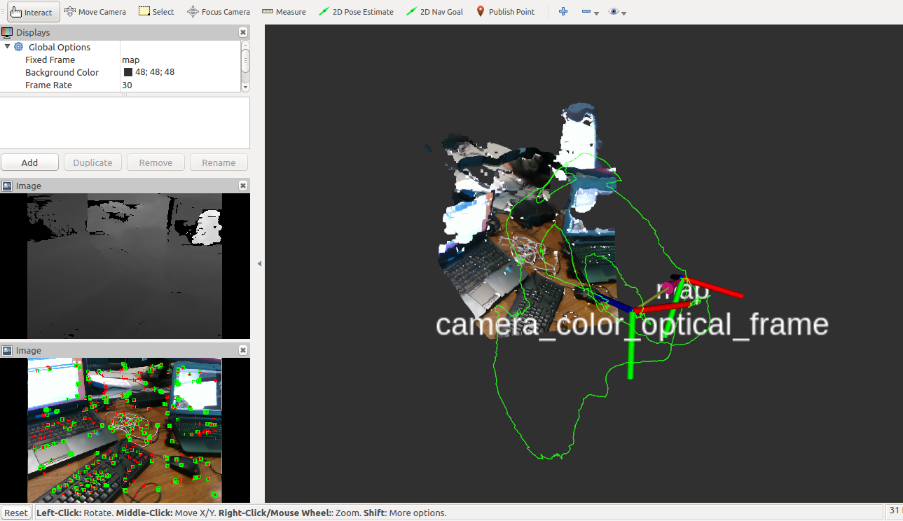

# Sparse RGB-D Visual Odometry #
Fast and lightweight sparse RGB-D visual odometry system based on [LVT](https://github.com/SAR-Research-Lab/lvt) method. The tracking aligns detected ORB keypoints to a limited sparse local map of features so as to reduce drift with regard to frame-to-frame approaches. [GMS](https://github.com/JiawangBian/GMS-Feature-Matcher) is used for robust feature matching.



## Requirements ##

- ### Ubuntu 16.04 or 18.04 ###
The system has been tested both on Ubuntu 16.04 and 18.04.

- ### [ROS](https://www.ros.org/) Kinetic or Melodic ###
Use ROS Kinetic on Ubuntu 16.04 and Melodic on 18.04.

- ### [OpenCV](https://opencv.org/) 3.4 ###
We use OpenCV 3.4 but any version of OpenCV 3 should work. OpenCV has to be installed with CUDA support and with contrib modules.
Note that you may need to rebuild the `vision_opencv` ROS packages against your OpenCV version installed from source.

- ### [G2O](https://github.com/RainerKuemmerle/g2o) ###

## Third Parties ##

Our implementation integrates parts of codes from external libraries.

### [ORB-SLAM2](http://github.com/raulmur/ORB-SLAM2) ###
For features extraction and associated descriptors computation.

### [GMS-Feature-Matcher](https://github.com/JiawangBian/GMS-Feature-Matcher) ###
We use Grid-based Motion Statistics for robust feature correspondence.

### [Lightweight Visual Tracking (LVT)](https://github.com/SAR-Research-Lab/lvt) ###
We based the design of our feature-based visual odometry on their method and our Perspective-n-Point solver has been implemented following their code.

## Building ##

The system is provided as a ROS package which can be copied or cloned into your workspace and built directly using catkin.

### 1. Clone the repository ###

```
$ cd ~/catkin_ws/src
$ git clone https://github.com/BruceCanovas/canovasb/sparse_rgbd_vo.git
```

### 2. Build ###

```
$ cd ~/catkin_ws
$ catkin_make
```

## Usage ##

Our system takes as input **registered** RGB-D frames. It is interfaced with a ROS node.

### Run with Intel Realsense ###

We provide a lauch file to start our system along an Intel RealSense cameras (D400 series SR300 camera and T265 Tracking Module) and an Rviz GUI. ROS drivers for Intel Realsense Devices can be found [here](https://github.com/IntelRealSense/realsense-ros). To use the visual odometry, open a terminal and execute:
```
$ roslaunch sparse_rgbd_vo sparse_rgbd_vo_realsense_rviz.launch
```

### Run with rosbag or other RGB-D sensors ###

To use SupersurfelFusion with other devices you just need to remap the `/camera_info`, `/image_color` and `/image_depth` topics in the sparse_rgbd_vo_rviz.launch to the topics published by your sensor or bagfile. Then start your device on ROS with registered RGB-D stream, or play your rosbag and execute:
```
$ roslaunch sparse_rgbd_vo sparse_rgbd_vo_rviz.launch
```
